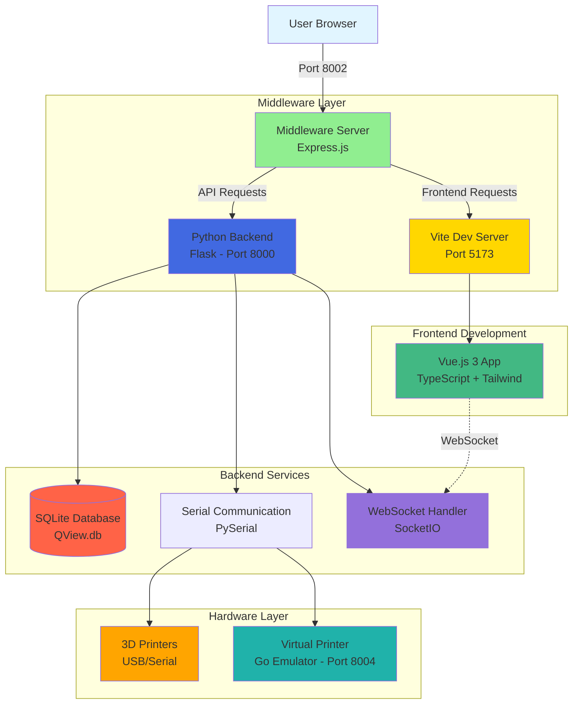
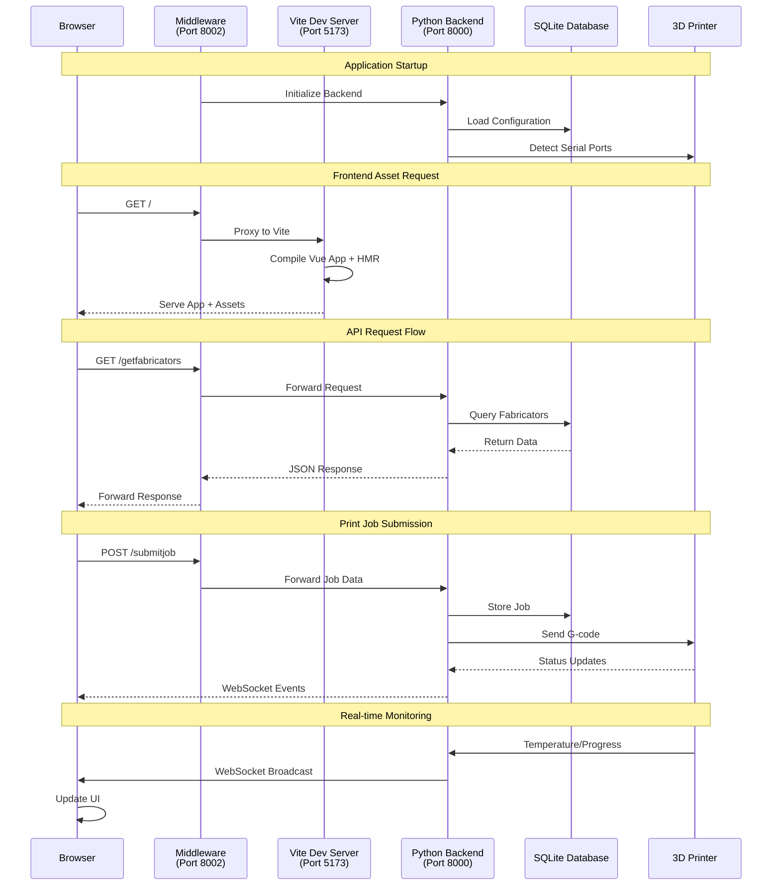

# QView3D

## Overview

QView3D, developed at SUNY's Hydra Lab, is an open-source software project designed to streamline the management and communication of 3D printing files to printer arrays. It offers users an expandable framework to enhance their workflow and take control of their process. Embracing an open community ethos, QView3D continuously evolves, actively seeking collaboration and feedback from users to improve and innovate.

The project is maintained by computer science students at SUNY New Paltz, under the guidance of Professor Michael Curry. Team members are responsible for the development, testing, and documentation of the software. The project is part of the Computer Science Department's capstone course, where students work on real-world projects to gain experience in software development.

## Lab Development Team

- [**Michael Curry**](https://github.com/currymike123)
- [**Lars Palombi**](https://github.com/Lars-Codes)
- [**Jack Gusler**](https://github.com/jackgusler)
- [**Olamide Kumapayi**](https://github.com/olakuma)
- [**Nathan Gopee**](https://github.com/ndg8743)
- [**Ari Yeger**](https://github.com/L10nhunter)
- [**CJ Jenks**](https://github.com/iron768)
- [**Stiviyan Dragiev**](https://github.com/dragiev1)
- [**Christopher Jamieson**](https://github.com/shift16)
- [**Youssup Song**](https://github.com/youssup)

## Features

### 🖨️ Printer Management
- **Concurrent Communication**: Manage multiple 3D printers simultaneously with real-time status updates.
- **Auto-Detection**: Automatic discovery of connected printers via serial ports.
- **Temperature Monitoring**: Live tracking of bed and extruder temperatures.
- **Status Tracking**: Real-time printer states (ready, printing, paused, offline, error).
- **Remote Control**: Start, pause, resume, and cancel prints from the web interface.

### 📋 Job Management
- **Smart Queue System**: Advanced queuing with drag-and-drop reordering.
- **Load Balancing**: Automatic distribution of jobs across available printers.
- **Job Prioritization**: Reorder queue items and set priority levels.
- **Rerun Capability**: Easy re-submission of completed jobs.
- **Job History**: Complete tracking with filtering, searching, and success/failure metrics.
- **File Management**: Automatic cleanup of old files with configurable retention policies.
- **Batch Operations**: Submit multiple jobs at once to different printers.

### 🎨 Advanced Visualization
- **3D Model Preview**: WebGL-based preview of models before printing with Z-axis correction.
- **GCode Viewer**: Layer-by-layer visualization of print paths.
- **Live Progress Display**: Real-time print progress with estimated completion time.
- **Console Logging**: View printer communication logs in real-time.

### 🛠️ Error Handling & Recovery
- **Automatic Issue Tracking**: Auto-creation of issues for print failures and errors.
- **Smart Timeout Handling**: Automatic recovery from communication timeouts.
- **Error Deduplication**: Prevents duplicate issue creation for recurring errors.
- **Print Recovery**: Resume prints after power loss or connection issues.
- **Detailed Logging**: Comprehensive error logs for debugging.

### 🧪 Development & Testing
- **Virtual Printer Emulator**: Go-based emulator to simulate printer behavior without hardware.
- **Mock Data Support**: Test with simulated printer responses.
- **Debug Mode**: Enhanced logging and development tools.
- **Cross-Platform Compatibility**: Runs on Windows, macOS, and Linux.

## Technologies

- **Frontend**: Vue.js 3 with Tailwind CSS for modern UI/UX.
- **Middleware**: Express.js server for routing and WebSocket management.
- **Backend**: Python Flask with SQLAlchemy ORM.
- **Communication**: Serial communication via PySerial, WebSockets for real-time updates.
- **Database**: SQLite for persistent storage.
- **Testing**: Virtual printer emulator built in Go for G-code simulation and testing.

## Architecture Diagram


### Interactive System Architecture


```mermaid
flowchart TB
    User[User Browser] -->|Port 8002| Middleware

    subgraph Middleware Layer
        Middleware[Middleware Server<br/>Express.js]
        Middleware -->|Frontend Requests| Vite[Vite Dev Server<br/>Port 5173]
        Middleware -->|API Requests| Python
    end

    subgraph Backend Services
        Python[Python Backend<br/>Flask - Port 8000]
        Python --> DB[(SQLite Database<br/>QView.db)]
        Python --> Serial[Serial Communication<br/>PySerial]
        Python --> WS[WebSocket Handler<br/>SocketIO]
    end

    subgraph Hardware Layer
        Serial --> Printers[3D Printers<br/>USB/Serial]
        Serial --> Emulator[Virtual Printer<br/>Go Emulator - Port 8004]
    end

    subgraph Frontend Development
        Vite --> Vue[Vue.js 3 App<br/>TypeScript + Tailwind]
        Vue -.->|WebSocket| WS
    end

    style User fill:#e1f5ff
    style Middleware fill:#90ee90
    style Vite fill:#ffd700
    style Python fill:#4169e1
    style DB fill:#ff6347
    style Printers fill:#ffa500
    style Vue fill:#42b883
    style WS fill:#9370db
    style Emulator fill:#20b2aa
```

### Request Flow Overview


```mermaid
sequenceDiagram
    participant B as Browser
    participant M as Middleware<br/>(Port 8002)
    participant V as Vite Dev Server<br/>(Port 5173)
    participant P as Python Backend<br/>(Port 8000)
    participant DB as SQLite Database
    participant PR as 3D Printer

    Note over B,PR: Application Startup
    M->>P: Initialize Backend
    P->>DB: Load Configuration
    P->>PR: Detect Serial Ports

    Note over B,PR: Frontend Asset Request
    B->>M: GET /
    M->>V: Proxy to Vite
    V->>V: Compile Vue App + HMR
    V-->>B: Serve App + Assets

    Note over B,PR: API Request Flow
    B->>M: GET /getfabricators
    M->>P: Forward Request
    P->>DB: Query Fabricators
    DB-->>P: Return Data
    P-->>M: JSON Response
    M-->>B: Forward Response

    Note over B,PR: Print Job Submission
    B->>M: POST /submitjob
    M->>P: Forward Job Data
    P->>DB: Store Job
    P->>PR: Send G-code
    PR-->>P: Status Updates
    P-->>B: WebSocket Events

    Note over B,PR: Real-time Monitoring
    PR->>P: Temperature/Progress
    P->>B: WebSocket Broadcast
    B->>B: Update UI
```

## Setup and Installation

### System Requirements
- **Ubuntu**: 20.04 LTS or later (native support)
- **macOS**: Supported
- **Windows**: Use WSL (Windows Subsystem for Linux) for best compatibility

### Installation Steps

Clone the repository:
```sh
git clone https://github.com/sunyhydralab/QView3D.git
cd QView3D
```

### Running on Different Operating Systems

#### Linux/macOS
```sh
python3 run.py
```

When prompted:
- Press `I` for first-time installation of dependencies
- Press `D` (or Enter) to run in debug mode

#### Windows (using WSL)
1. Install WSL with Ubuntu if not already installed:
   ```powershell
   wsl --install -d Ubuntu
   ```

2. Run from Windows PowerShell or Command Prompt:
   ```powershell
   wsl -d Ubuntu -- bash -c "cd /mnt/c/path/to/your/QView3D && echo 'D' | python3 run.py"
   ```

   Replace `/mnt/c/path/to/your/QView3D` with your actual project path.

   Example: If your project is at `C:\Users\YourName\Projects\QView3D`, use:
   ```powershell
   wsl -d Ubuntu -- bash -c "cd /mnt/c/Users/YourName/Projects/QView3D && echo 'D' | python3 run.py"
   ```

3. For first-time setup (install dependencies):
   ```powershell
   wsl -d Ubuntu -- bash -c "cd /mnt/c/path/to/your/QView3D && echo 'I' | python3 run.py"
   ```

#### Windows (native - experimental)
```sh
python run.py
# Note: Serial port access may require administrator privileges
```

### First Run
1. Select `I` to install dependencies
2. Run again and press `D` or Enter for debug mode

### Accessing the Application
Once started, access the application at: **http://localhost:8002**

## Pull Requests

We welcome contributions to QView3D. Please follow the guidelines in the [CONTRIBUTING.md](CONTRIBUTING.md) file.

## License

This project is licensed under the MIT License - see the [LICENSE.md](LICENSE.md) file for details.

## Version

1.0.0
