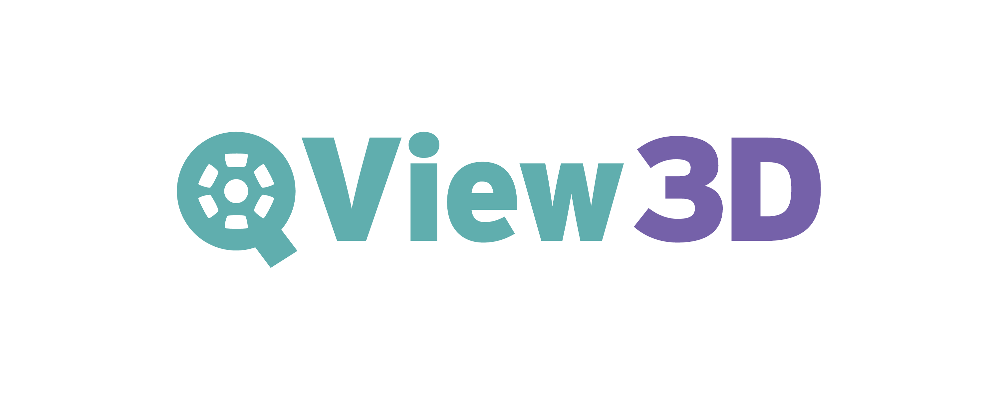
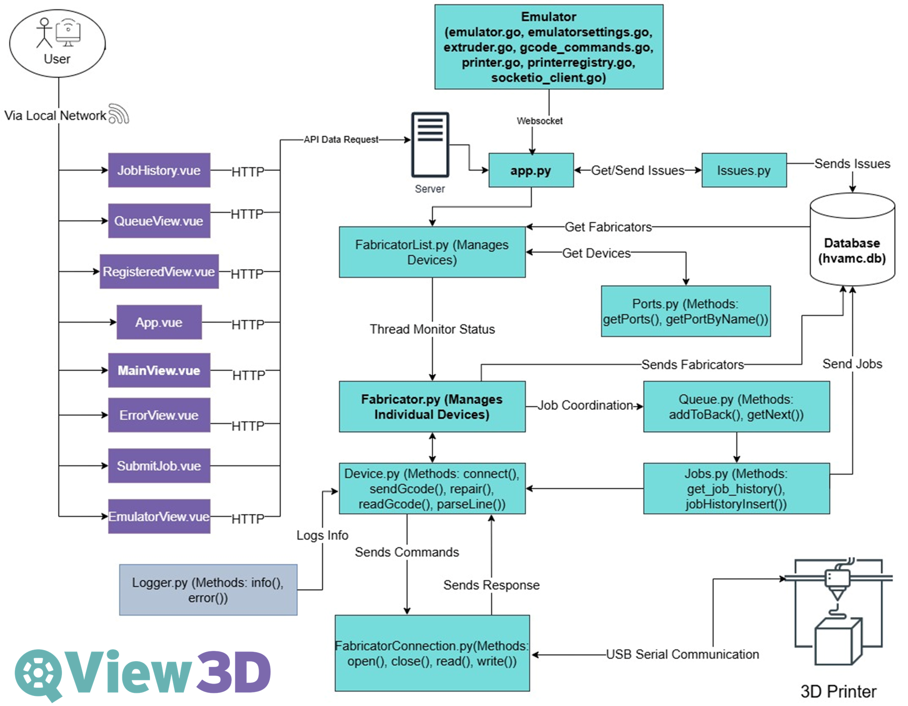
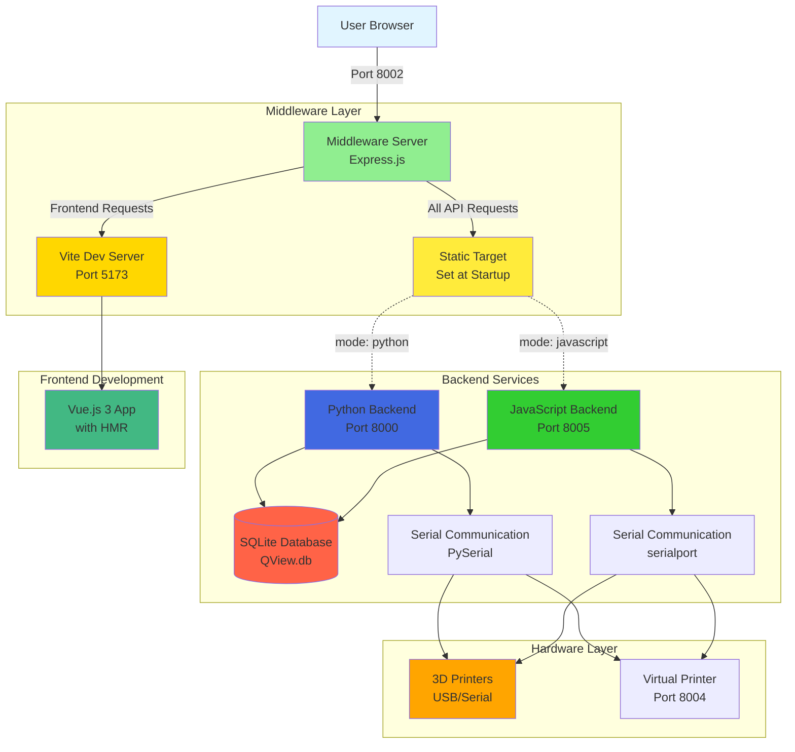
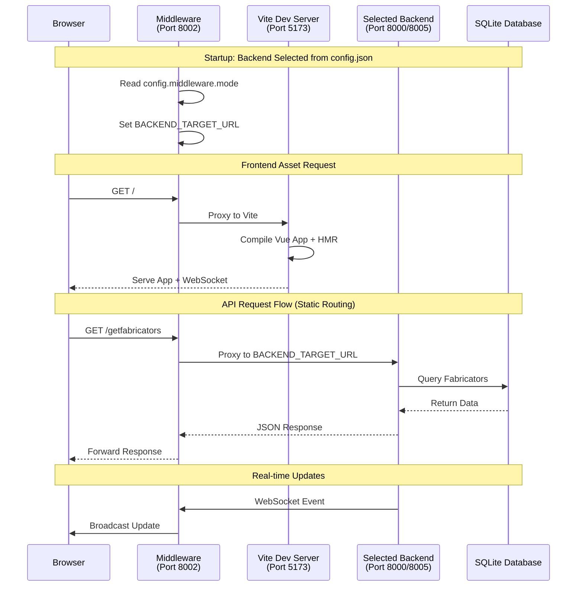

# QView3D

## Overview

QView3D, developed at SUNY's Hydra Lab, is an open-source software project designed to streamline the management and communication of 3D printing files to printer arrays. It offers users an expandable framework to enhance their workflow and take control of their process. Embracing an open community ethos, QView3D continuously evolves, actively seeking collaboration and feedback from users to improve and innovate.

The project is maintained by computer science students at SUNY New Paltz, under the guidance of Professor Michael Curry. Team members are responsible for the development, testing, and documentation of the software. The project is part of the Computer Science Department's capstone course, where students work on real-world projects to gain experience in software development.

## Lab Development Team

- [**Michael Curry**](https://github.com/currymike123)
- [**Lars Palombi**](https://github.com/Lars-Codes)
- [**Jack Gusler**](https://github.com/jackgusler)
- [**Olamide Kumapayi**](https://github.com/olakuma)
- [**Nathan Gopee**](https://github.com/ndg8743)
- [**Ari Yeger**](https://github.com/L10nhunter)
- [**CJ Jenks**](https://github.com/iron768)
- [**Stiviyan Dragiev**](https://github.com/dragiev1)
- [**Christopher Jamieson**](https://github.com/shift16)
- [**Youssup Song**](https://github.com/youssup)

## Features

- **Concurrent Communication**: Manage multiple 3D printers simultaneously.
- **Job Management**:
  - Local storage of database.
  - Load balancing to distribute jobs across multiple printers.
  - Storage management for purging old files while retaining essential data.
  - Job prioritization and favoring.
  - Comprehensive job filtering and history tracking.
  - Initiate printer pauses and filament color changes.
  - Supports various printer models.
- **Error Logging**: Assign comments and track issues for past jobs to analyze job success and error rates.
- **Advanced Viewing**:
  - Real-time 3D model previews before and during printing.
  - Layer-by-layer virtual print monitoring via GCode Viewer.
- **Virtual Printer Emulator**: A Go-based emulator to simulate printer behavior, enabling testing without physical hardware.
- **Cross-Platform Compatibility**: Runs on Windows, macOS, and Linux, ensuring accessibility across systems.

## Technologies

- **Frontend**: Vue.js with Bootstrap for styling.
- **Backend**: Flask integrated with SQLite, handling data through Node.js.
- **Communication**: Serial communication via PySerial.
- **Database**: SQLite.
- **Testing**: Virtual printer emulator built in Go for G-code simulation and testing.

## Architecture Diagram



### Interactive System Architecture


```mermaid
flowchart TB
    User[User Browser] -->|Port 8002| Middleware

    subgraph Middleware Layer
        Middleware[Middleware Server<br/>Express.js]
        Middleware -->|Frontend Requests| Vite[Vite Dev Server<br/>Port 5173]
        Middleware -->|All API Requests| Target[Static Target<br/>Set at Startup]
    end

    subgraph Backend Services
        Target -.->|mode: python| Python[Python Backend<br/>Port 8000]
        Target -.->|mode: javascript| JS[JavaScript Backend<br/>Port 8005]
        Python --> DB[(SQLite Database<br/>QView.db)]
        JS --> DB
        Python --> Serial[Serial Communication<br/>PySerial]
        JS --> Serial2[Serial Communication<br/>serialport]
    end

    subgraph Hardware Layer
        Serial --> Printers[3D Printers<br/>USB/Serial]
        Serial2 --> Printers
        Serial --> Emulator[Virtual Printer<br/>Port 8004]
        Serial2 --> Emulator
    end

    subgraph Frontend Development
        Vite --> Vue[Vue.js 3 App<br/>with HMR]
    end

    style User fill:#e1f5ff
    style Middleware fill:#90ee90
    style Target fill:#ffeb3b
    style Vite fill:#ffd700
    style Python fill:#4169e1
    style JS fill:#32cd32
    style DB fill:#ff6347
    style Printers fill:#ffa500
    style Vue fill:#42b883
```

### Request Flow Overview


```mermaid
sequenceDiagram
    participant B as Browser
    participant M as Middleware<br/>(Port 8002)
    participant V as Vite Dev Server<br/>(Port 5173)
    participant BE as Selected Backend<br/>(Port 8000/8005)
    participant DB as SQLite Database

    Note over B,DB: Startup: Backend Selected from config.json
    M->>M: Read config.middleware.mode
    M->>M: Set BACKEND_TARGET_URL

    Note over B,DB: Frontend Asset Request
    B->>M: GET /
    M->>V: Proxy to Vite
    V->>V: Compile Vue App + HMR
    V-->>B: Serve App + WebSocket

    Note over B,DB: API Request Flow (Static Routing)
    B->>M: GET /getfabricators
    M->>BE: Proxy to BACKEND_TARGET_URL
    BE->>DB: Query Fabricators
    DB-->>BE: Return Data
    BE-->>M: JSON Response
    M-->>B: Forward Response

    Note over B,DB: Real-time Updates
    BE->>M: WebSocket Event
    M->>B: Broadcast Update
```

## Setup and Installation

### System Requirements
- **Ubuntu**: 20.04 LTS or later (native support)
- **macOS**: Supported
- **Windows**: Use WSL (Windows Subsystem for Linux) for best compatibility

### Installation Steps

Clone the repository:
```sh
git clone https://github.com/sunyhydralab/QView3D.git
cd QView3D
```

### Running on Different Operating Systems

#### Linux/macOS
```sh
python3 run.py
```

When prompted:
- Press `I` for first-time installation of dependencies
- Press `D` (or Enter) to run in debug mode (starts both backends with redundant failover)

#### Windows (using WSL)
1. Install WSL with Ubuntu if not already installed:
   ```powershell
   wsl --install -d Ubuntu
   ```

2. Run from Windows PowerShell or Command Prompt:
   ```powershell
   wsl -d Ubuntu -- bash -c "cd /mnt/c/path/to/your/QView3D && echo 'D' | python3 run.py"
   ```

   Replace `/mnt/c/path/to/your/QView3D` with your actual project path.

   Example: If your project is at `C:\Users\YourName\Projects\QView3D`, use:
   ```powershell
   wsl -d Ubuntu -- bash -c "cd /mnt/c/Users/YourName/Projects/QView3D && echo 'D' | python3 run.py"
   ```

3. For first-time setup (install dependencies):
   ```powershell
   wsl -d Ubuntu -- bash -c "cd /mnt/c/path/to/your/QView3D && echo 'I' | python3 run.py"
   ```

#### Windows (native - experimental)
```sh
python run.py
# Note: Serial port access may require administrator privileges
```

### First Run
1. Select `I` to install dependencies
2. Run again and press `D` or Enter for debug mode (starts both Python and JavaScript backends with automatic failover)

### Accessing the Application
Once started, access the application at:
- Frontend: http://localhost:8002
- Python Backend: http://localhost:8000
- JavaScript Backend: http://localhost:3000
- Middleware (routing layer): http://localhost:3500

You can change your preferred backend in the Settings panel (gear icon in bottom right)

## Pull Requests

We welcome contributions to QView3D. Please follow the guidelines in the [CONTRIBUTING.md](CONTRIBUTING.md) file.

## License

This project is licensed under the MIT License - see the [LICENSE.md](LICENSE.md) file for details.

## Version

1.0.0
