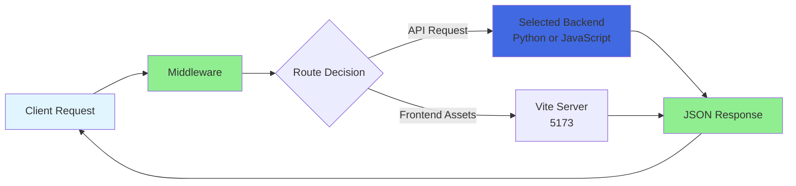
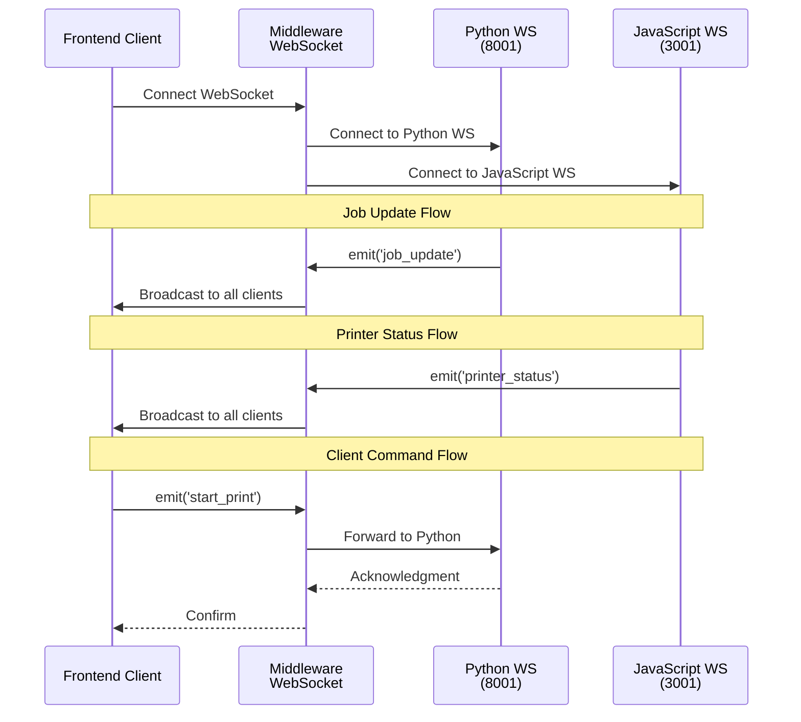
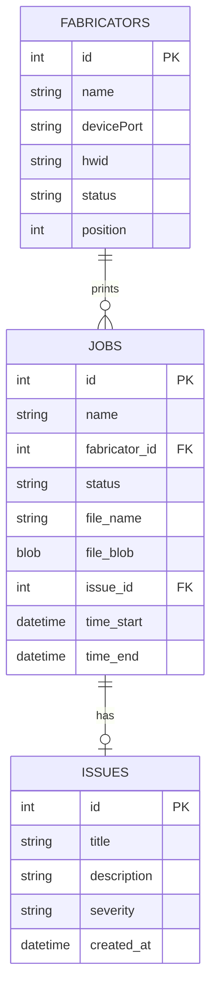

# QView3D Architecture

## System Overview

QView3D uses a multi-backend architecture with middleware-based routing.

## Components

### Frontend (Port 8002)
- Vue 3 with Composition API
- TailwindCSS for styling
- WebSocket client for real-time updates
- GCode preview and 3D model visualization

### Middleware (Port 3500)
Express.js proxy that:
- Routes all requests to the configured backend (Python or JavaScript)
- Acts as a transparent proxy layer
- Handles WebSocket proxy connections

### Python Backend (Port 8000)
Flask server handling:
- Database operations (SQLite)
- Job management and queuing
- Issue tracking
- File uploads and storage

### JavaScript Backend (Port 3000)
Node.js server handling:
- Serial port communication
- Real-time printer control
- Virtual printer emulator
- Hardware detection

## Request Flow

### Request Routing Diagram

## Backend Capabilities

### Python Backend
- Job management and queuing
- Issue tracking
- File uploads and storage
- Database operations (SQLite)

### JavaScript Backend
- Serial port communication
- Real-time printer control
- Virtual printer emulator
- Hardware detection

## WebSocket Architecture

Two WebSocket servers run in parallel:
- Python WS (8001): Job updates, queue changes
- JavaScript WS (3001): Real-time printer status, serial data

### WebSocket Communication Flow

## Database

SQLite database managed by Python backend:
- Jobs and queue
- Issue tracking
- Printer configurations
- User settings

### Database Relationships

