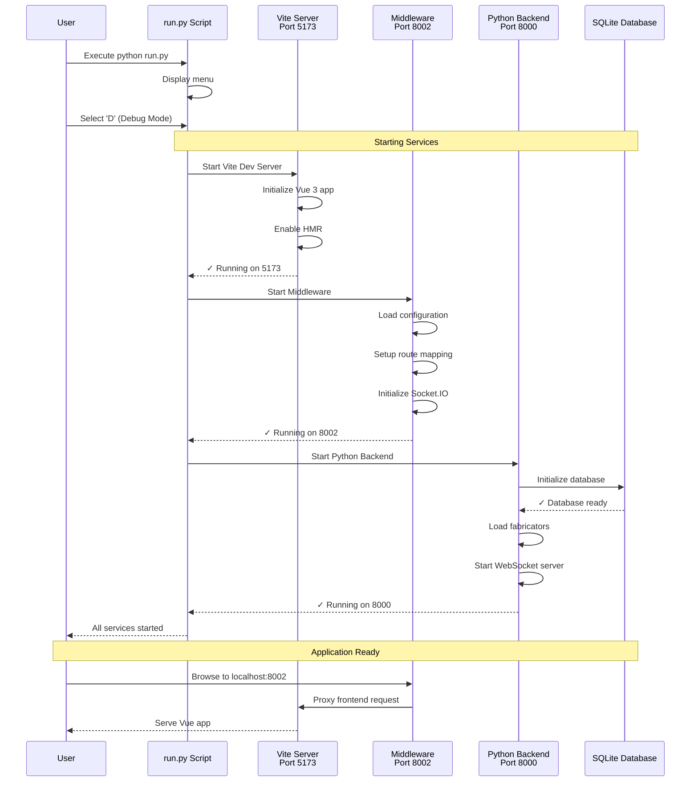

# QView3D Setup Guide for WSL/Ubuntu

This guide will help you set up and run QView3D on WSL (Windows Subsystem for Linux) or Ubuntu.

## Prerequisites

- WSL with Ubuntu installed, or a Linux/macOS system
- Internet connection for downloading dependencies

## Step 1: Update System Packages

First, update your package list to ensure you have the latest package information:

```bash
sudo apt update
```

## Step 2: Install Required Dependencies

Install Python 3.12, Node.js, npm, and other essential tools:

```bash
sudo apt update && sudo apt install -y python3.12 python3.12-venv python3-pip nodejs npm
```

This will install:
- Python 3.12 and virtual environment support
- pip (Python package manager)
- Node.js (JavaScript runtime)
- npm (Node package manager)

## Step 3: Clone the QView3D Repository

Clone the QView3D project from GitHub:

```bash
git clone https://github.com/sunyhydralab/QView3D.git
cd QView3D
```

## Step 4: Run the Application

Navigate to the project directory and run the setup script:

```bash
python3 run.py
```

When prompted, choose your option:
- **I** - Install Dependencies (first time setup)
- **D** - Run in debug mode (default)
- **R** - Run in release mode
- **C** - Cancel

### First Time Setup

If this is your first time running the project, select **I** to install dependencies. This will:
- Create a Python virtual environment
- Install all Python dependencies from `server/dependencies.txt`
- Install all Node.js dependencies for the frontend

### Running the Application

After dependencies are installed, run the application again and select **D** for debug mode:

```bash
python3 run.py
```

## Step 5: Access the Application

Once the application starts successfully, you'll see output similar to:

```
Starting WebSocket server...
Starting Flask application...
Flask application started
 * Running on http://localhost:8000
```

### Access URLs:

- **Main Application (Frontend)**: `http://localhost:8002`
- **Backend API**: `http://localhost:8000`
- **Vue DevTools**: `http://localhost:8002/__devtools__/`

## What's Running

When QView3D starts successfully, you'll have:

- ✅ **Flask Server** on port 8000 (backend API)
- ✅ **Vue.js Frontend** on port 8002 (main UI)
- ✅ **WebSocket Server** for real-time communication
- ✅ **SQLite Database** initialized
- ✅ **Fabricator Management System** ready

### Application Startup Sequence



## Troubleshooting

### Common Issues:

1. **"python command not found"**
   - Use `python3` instead of `python`

2. **"flask command not found"**
   - Make sure you selected "I" to install dependencies first

3. **Permission errors**
   - Make sure you have proper permissions in your WSL environment

4. **Port already in use**
   - Stop any existing processes using ports 8000 or 8002
   - Or modify the ports in `run.py` if needed

### Stopping the Application

To stop the application, press `Ctrl+C` in the terminal where it's running.

## Project Structure

```
QView3D/
├── client/          # Vue.js frontend
├── server/          # Flask backend
├── server-javascript/ # Node.js components
├── printeremu/      # Go-based printer emulator
├── run.py          # Main startup script
└── README.md       # Project documentation
```

## Features (in various states of progress :)

QView3D provides:
- **Concurrent Communication**: Manage multiple 3D printers simultaneously
- **Job Management**: Load balancing, prioritization, and history tracking
- **Real-time Monitoring**: Live 3D model previews and GCode viewing
- **Virtual Printer Emulator**: Test without physical hardware
- **Cross-Platform**: Runs on Windows (WSL), macOS, and Linux

## Next Steps

1. Open your browser and navigate to `http://localhost:8002`
2. Register your 3D printers/fabricators
3. Upload GCode files and manage print jobs
4. Monitor print progress in real-time

## Support

For issues or questions:
- Check the [GitHub repository](https://github.com/sunyhydralab/QView3D)
- Review the project documentation in the `docs/` folder
- Open an issue on GitHub for bugs or feature requests

---

**Note**: This guide assumes you're using WSL with Ubuntu. For other Linux distributions or macOS, the package manager commands may differ (e.g., `brew` for macOS).
