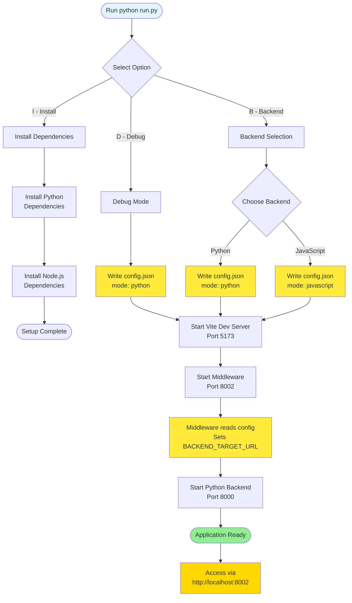
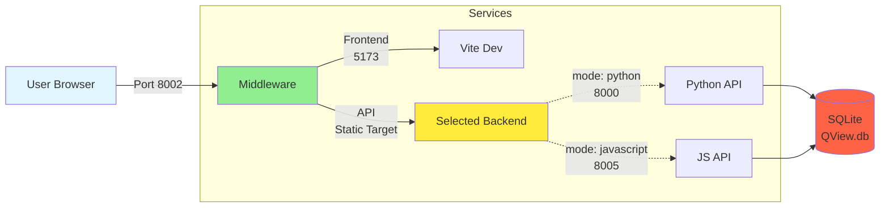

# Setup Guide

## Prerequisites

- Python 3.12+
- Node.js 18+
- npm
- Git

## Installation

1. Clone the repository:
```bash
git clone https://github.com/sunyhydralab/QView3D.git
cd QView3D
```

2. Install dependencies:
```bash
python run.py
# Select 'I' for install
```

## Running the Application

### Quick Start
```bash
python run.py
# Select 'D' for debug mode (Python backend by default)
```

### Backend Selection
```bash
python run.py
# Select 'B' to choose backend mode
```

Options:
- **Python Backend**: Traditional Flask server (mode 1)
- **JavaScript Backend**: Node.js with serial support (mode 2)

### Startup Sequence Diagram



## Manual Setup

### Frontend
```bash
cd client
npm install
npm run dev
```

### Python Backend
```bash
cd server-python
python -m venv .python-venv
# Windows: .python-venv\Scripts\activate
# Linux/Mac: source .python-venv/bin/activate
pip install -r dependencies.txt
flask run
```

### JavaScript Backend
```bash
cd server-javascript
npm install
npm start
```

### Middleware
```bash
cd middleware
npm install
node src/index.js
```

## Configuration

### Ports
- Frontend: 8002
- Python API: 8000
- JavaScript API: 3000
- Middleware: 3500

### Port Configuration Diagram



### Database
- Location: `server-python/QView.db`
- Reset: Delete file for fresh start

## Testing

### Virtual Printer
Access the emulator at http://localhost:8002/emulator

### Running Tests
```bash
# Frontend
cd client && npm run test:unit

# JavaScript Backend
cd server-javascript && npm test
```

## Troubleshooting

### Port Conflicts
Check if ports 3000, 3500, 8000-8002 are available

### Serial Port Access
- Windows: Run as administrator
- Linux: Add user to dialout group

### Python Version
Ensure Python 3.12+ is installed

### Database Issues
Delete `server-python/QView.db` to reset