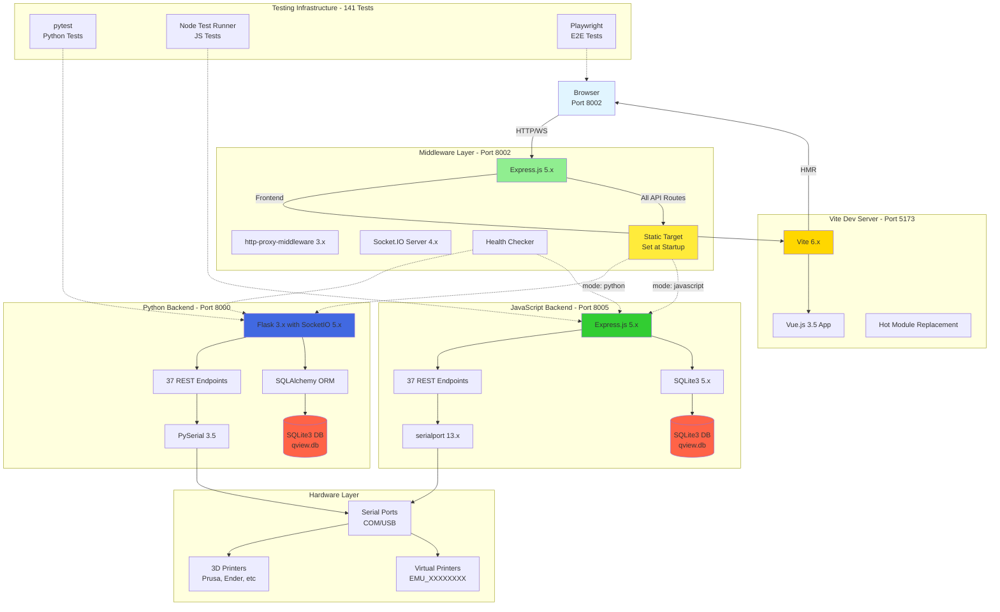
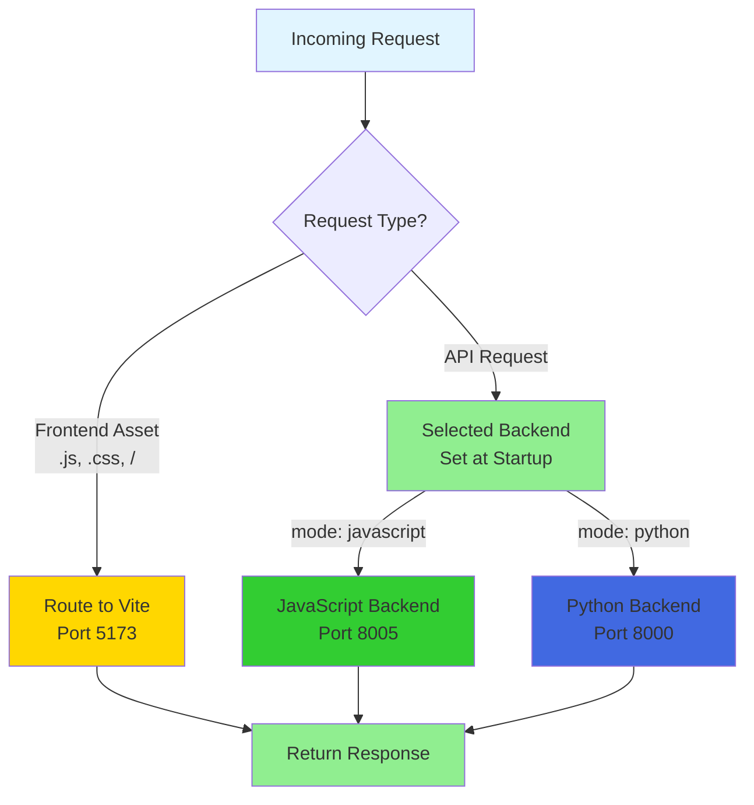
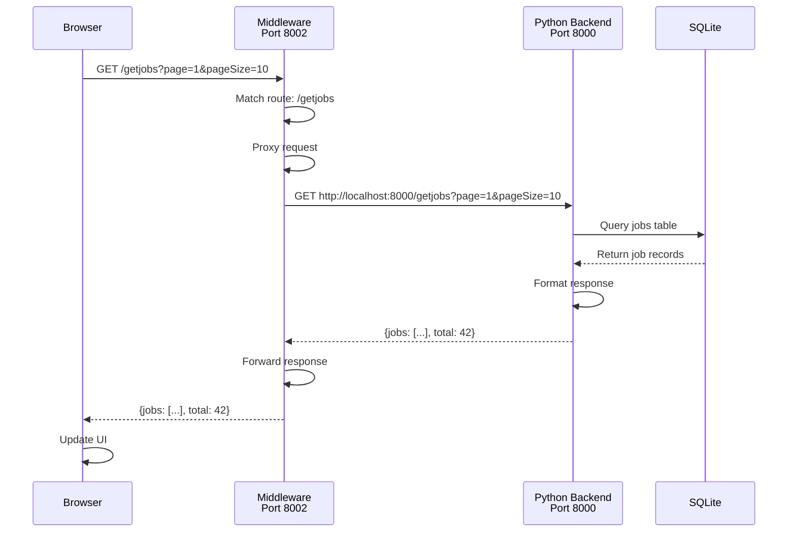
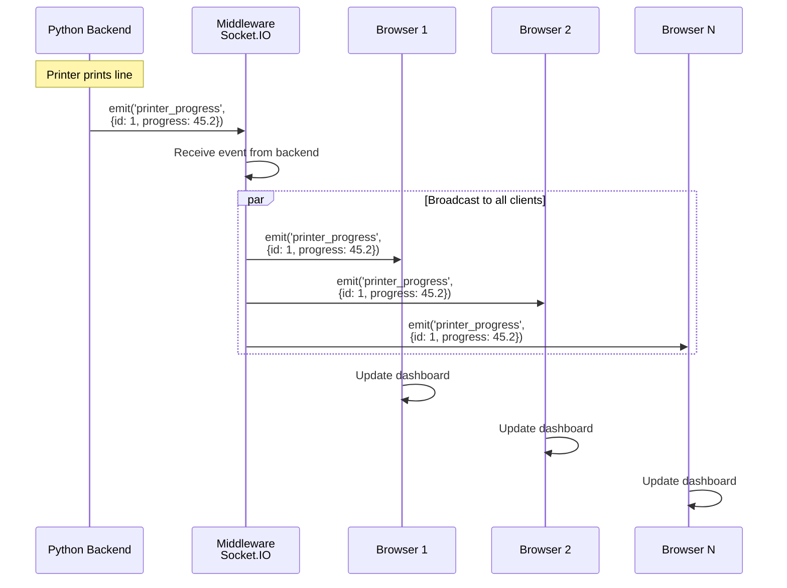

# QView3D Middleware Architecture

## Table of Contents
1. [Overview](#overview)
2. [Architecture](#architecture)
3. [How It Works](#how-it-works)
4. [Request Flow](#request-flow)
5. [Configuration](#configuration)
6. [API Reference](#api-reference)
7. [Backend Comparison](#backend-comparison)
8. [Development Guide](#development-guide)

---

## Overview

The QView3D middleware is a Node.js Express server that acts as a **reverse proxy** and **communication layer** between the Vue.js frontend and the backend services (Python Flask or Node.js). It provides:

- **Frontend Proxying**: Proxies requests to Vite dev server for dynamic development with Hot Module Replacement (HMR)
- **API Proxying**: Routes API requests to the appropriate backend
- **WebSocket Proxying**: Forwards Socket.IO events bidirectionally
- **Backend Abstraction**: Shields the frontend from backend implementation details

### Key Benefits

1. **Single Entry Point**: Clients connect to one port (8002) regardless of backend
2. **Backend Switching**: Switch between Python/JavaScript backends without frontend changes
3. **Load Distribution**: Can distribute requests between multiple backend instances
4. **Development Flexibility**: Frontend and backend can be developed independently

---

## Architecture

```
┌──────────────────────────────────────────────────────────────┐
│                         Browser                              │
│                   http://localhost:8002                      │
└────────────────────────┬─────────────────────────────────────┘
                         │
                         │ HTTP/WebSocket
                         ▼
┌──────────────────────────────────────────────────────────────┐
│                  MIDDLEWARE SERVER (Port 8002)               │
│  ┌────────────────────────────────────────────────────────┐  │
│  │ Express.js Server                                      │  │
│  │  - Frontend Proxy → Vite dev server (5173)            │  │
│  │  - API Route Proxy → Backend (8000/8005)              │  │
│  │  - WebSocket Proxy (HMR + Socket.IO)                  │  │
│  └────────────────────────────────────────────────────────┘  │
│  ┌────────────────────────────────────────────────────────┐  │
│  │ Socket.IO Server                                       │  │
│  │  - Accepts client connections                          │  │
│  │  - Forwards events to backend                          │  │
│  │  - Broadcasts backend events to clients                │  │
│  └────────────────────────────────────────────────────────┘  │
└─────────┬──────────────────────────┬─────────────────────────┘
          │                          │
          │ HTTP/Socket.IO           │ HTTP/WebSocket (HMR)
          ▼                          ▼
   ┌──────────────┐          ┌──────────────────┐
   │   Backends   │          │  Vite Dev Server │
   │              │          │   (Port 5173)    │
   └──────┬───────┘          │                  │
          │                  │ - Vue.js HMR     │
┌─────────┴────────┐         │ - Asset serving  │
│                  │         │ - Live reload    │
▼                  ▼         └──────────────────┘
┌──────────────────┐ ┌──────────────────┐
│ Python Backend   │ │ JavaScript       │
│ (Port 8000)      │ │ Backend          │
│                  │ │ (Port 8005)      │
│ - Flask Server   │ │ - Express Server │
│ - Socket.IO      │ │ - WebSocket      │
│ - SQLite3        │ │ - SQLite3        │
│ - PySerial       │ │ - SerialPort     │
│ - Full Features  │ │ - Core Features  │
└──────────────────┘ └──────────────────┘
        │                      │
        └──────────┬───────────┘
                   │
                   ▼
         ┌──────────────────┐
         │  Serial Ports    │
         │  3D Printers     │
         │  Virtual Devices │
         └──────────────────┘
```

---

## Technology Stack

### Complete System Overview



### Technology Details

#### Frontend Stack
| Technology | Version | Purpose |
|------------|---------|---------|
| **Vue.js** | 3.5+ | Progressive JavaScript framework with Composition API |
| **TypeScript** | 5.x | Type-safe JavaScript with enhanced IDE support |
| **Vite** | 6.x | Lightning-fast dev server with Hot Module Replacement |
| **Tailwind CSS** | 3.x | Utility-first CSS framework for rapid UI development |
| **Vue Router** | 4.x | Official router with history mode and lazy loading |
| **Pinia** | 2.x | Type-safe state management (Vuex successor) |
| **Socket.IO Client** | 4.x | Real-time bidirectional event-based communication |
| **Playwright** | 1.40+ | End-to-end testing framework |

#### Middleware Stack
| Technology | Version | Purpose |
|------------|---------|---------|
| **Express.js** | 5.x | Web application framework |
| **http-proxy-middleware** | 3.x | HTTP/WebSocket proxy for routing requests |
| **Socket.IO** | 4.x | Real-time communication server |
| **cors** | 2.x | Cross-Origin Resource Sharing middleware |
| **Node.js** | 18+ | JavaScript runtime environment |

#### Python Backend Stack
| Technology | Version | Purpose |
|------------|---------|---------|
| **Flask** | 3.x | Lightweight WSGI web application framework |
| **Flask-SocketIO** | 5.x | Socket.IO integration for Flask |
| **SQLAlchemy** | 2.x | Python SQL toolkit and ORM |
| **PySerial** | 3.5+ | Serial port access library |
| **Eventlet** | 0.37+ | Concurrent networking library (WSGI server) |
| **Python** | 3.9+ | Programming language |

#### JavaScript Backend Stack
| Technology | Version | Purpose |
|------------|---------|---------|
| **Express.js** | 5.x | Web application framework |
| **sqlite3** | 5.x | SQLite3 bindings for Node.js |
| **@serialport/stream** | 13.x | Serial port communication library |
| **ws** | 8.x | WebSocket implementation |
| **Node.js** | 18+ | JavaScript runtime environment |

#### Database
| Technology | Purpose |
|------------|---------|
| **SQLite3** | Embedded relational database (used by both backends) |
| **Schema** | Tables: fabricators, jobs, queue, issues |

#### Hardware Communication
| Technology | Purpose |
|------------|---------|
| **PySerial** | Python serial port library for 3D printer communication |
| **@serialport/stream** | Node.js serial port library |
| **Virtual Serial** | Software-emulated serial ports (EMU_ prefix) |

#### Testing Stack
| Technology | Type | Purpose |
|------------|------|---------|
| **pytest** | Unit | Python backend unit tests (15 tests) |
| **Node Test Runner** | Unit | JavaScript backend unit tests (80+ tests) |
| **Playwright** | E2E | Browser automation and end-to-end testing (7 tests) |
| **Vitest** | Unit | Fast unit test framework for Vite projects |

#### Development Tools
| Tool | Purpose |
|------|---------|
| **ESLint** | JavaScript/TypeScript linting |
| **Prettier** | Code formatting |
| **TypeScript Compiler** | Type checking and transpilation |
| **npm/pip** | Package management |
| **Git** | Version control |

#### Port Configuration
| Service | Port | Protocol | Purpose |
|---------|------|----------|---------|
| Middleware | 8002 | HTTP/WS | Main entry point for all client requests |
| Vite Dev Server | 5173 | HTTP/WS | Frontend development with HMR |
| Python Backend | 8000 | HTTP/WS | Primary backend with full features |
| JavaScript Backend | 8005 | HTTP/WS | Alternative backend with core features |
| Python Emulator | 8004 | HTTP | Virtual printer emulator (Python) |
| JavaScript Emulator | 8007 | HTTP | Virtual printer emulator (JavaScript) |

---

## How It Works

### 1. Frontend Proxying (Vite Dev Server)

The middleware proxies all frontend requests to the Vite dev server for dynamic development:

```javascript
// Proxy to Vite dev server for dynamic development with HMR
const VITE_DEV_SERVER = 'http://localhost:5173';

app.use('/', createProxyMiddleware({
  target: VITE_DEV_SERVER,
  changeOrigin: true,
  ws: true,  // Enable WebSocket for Vite HMR
  onError: (err, req, res) => {
    console.error(`[Vite Proxy Error] ${req.path}:`, err.message);
    res.status(502).json({
      error: 'Vite dev server connection failed',
      hint: 'Make sure Vite dev server is running on port 5173'
    });
  }
}));
```

**Flow:**
1. Browser requests `http://localhost:8002/`
2. Middleware proxies request to Vite dev server (`http://localhost:5173/`)
3. Vite serves Vue.js app with Hot Module Replacement (HMR) support
4. Browser loads app and establishes WebSocket connection for HMR
5. Changes to Vue files trigger instant updates without full page reload

**Benefits of Vite Proxy:**
- ✅ **Instant Updates**: HMR provides ~200ms feedback for code changes
- ✅ **No Build Step**: No need to run `npm run build` during development
- ✅ **Source Maps**: Better debugging with original source code
- ✅ **Fast Startup**: Vite's on-demand compilation is faster than bundling

### 2. API Proxying (Static Routing)

API requests are proxied to a single backend selected at startup:

```javascript
// Backend selection - determined ONCE at startup from config
const SELECTED_BACKEND = config.middleware.mode || 'python';
const BACKEND_CONFIG = SELECTED_BACKEND === 'python' ? config.backends.python : config.backends.javascript;
const BACKEND_TARGET_URL = BACKEND_CONFIG.url;

const apiRoutes = [
  '/api',
  '/getfabricators',
  '/getjobs',
  '/getports',
  '/register',
  // ... 30+ more routes
];

// All routes are statically proxied to the same backend
apiRoutes.forEach(route => {
  app.use(route, createProxyMiddleware({
    target: BACKEND_TARGET_URL,  // Static target set at startup
    changeOrigin: true,
    ws: route === '/socket.io'
  }));
});
```

**Flow:**
1. Frontend makes API call: `fetch('/getjobs')`
2. Middleware intercepts the request
3. Proxies to selected backend: `${BACKEND_TARGET_URL}/getjobs`
4. Backend processes and returns response
5. Middleware forwards response to frontend

**Key Point:** The backend target is determined once at startup based on `config.middleware.mode`, not per-request.

### 3. Socket.IO Proxying

Real-time events are forwarded bidirectionally:

```javascript
// Middleware acts as Socket.IO CLIENT to backend
backendSocket = ioClient('http://localhost:8000');

// Middleware acts as Socket.IO SERVER to frontend
io.on('connection', (socket) => {
  // Forward client events to backend
  socket.onAny((event, ...args) => {
    backendSocket.emit(event, ...args);
  });

  // Forward backend events to all clients
  backendSocket.onAny((event, ...args) => {
    io.emit(event, ...args);
  });
});
```

**Flow:**
1. Frontend connects to middleware Socket.IO
2. Middleware maintains connection to backend
3. Events flow: Frontend → Middleware → Backend
4. Broadcasts: Backend → Middleware → All Frontends

### 4. Static Backend Selection

The middleware uses a **static routing architecture** where the backend is selected once at startup:

**Backend Selection Process:**
1. Middleware reads `config.json` at startup
2. `config.middleware.mode` determines which backend to use (`'python'` or `'javascript'`)
3. All API routes are statically proxied to the selected backend
4. No per-request routing decisions - simple pass-through proxy

**Example Configuration** (`server-python/config/config.json`):
```json
{
  "middleware": {
    "mode": "python",
    "port": 8002
  },
  "backends": {
    "python": {
      "url": "http://localhost:8000"
    },
    "javascript": {
      "url": "http://localhost:8005"
    }
  }
}
```

#### Static Routing Flow



---

## Request Flow

### Example: Job History Request



### Example: Printer Status Update (WebSocket)



---

## Configuration

### Backend Configuration

**File:** `middleware/src/config/backends.js`

Loads configuration from `server-python/config/config.json`:

```json
{
  "middleware": {
    "mode": "python",
    "port": 8002
  },
  "backends": {
    "python": {
      "url": "http://localhost:8000",
      "port": 8000,
      "ws_port": 8000,
      "emulator_port": 8004
    },
    "javascript": {
      "url": "http://localhost:8005",
      "port": 8005,
      "ws_port": 8005,
      "emulator_port": 8007
    }
  }
}
```

**Configuration Options:**
- `middleware.mode`: Default backend ('python' or 'javascript')
- `middleware.port`: Middleware server port (default: 8002)
- `backends.*.url`: Backend base URL
- `backends.*.emulator_port`: Port for virtual printer emulator

### Startup Configuration

The `run.py` script updates `config.json` before starting services:

```python
def update_config_json():
    config['middleware'] = {
        "port": MIDDLEWARE_PORT,
        "mode": BACKEND_MODE  # User selected: 'python' or 'javascript'
    }
```

---

## API Reference

### Middleware-Specific Endpoints

#### `GET /api/middleware/health`
Health check for middleware status.

**Query Parameters:**
- `debug=true` - Include backend status information

**Response:**
```json
{
  "status": "healthy",
  "server_backend": "python",
  "server_url": "http://localhost:8000",
  "server_status": {
    "status": "healthy",
    "uptime": 12345.67
  }
}
```

#### `POST /api/middleware/select-backend` (Planned)
Switch between Python and JavaScript backends.

**Request Body:**
```json
{
  "backend": "javascript"
}
```

**Response:**
```json
{
  "success": true,
  "active_backend": "javascript",
  "backend_url": "http://localhost:8005"
}
```

### Proxied API Routes

All routes in the `apiRoutes` array are proxied to the backend:

**Core Routes:**
- `/api/*` - All API endpoints
- `/getfabricators` - List registered printers
- `/getjobs` - Job history with pagination
- `/getports` - Available serial ports
- `/register` - Register new printer
- `/addjobtoqueue` - Upload and queue print job
- `/startprint` - Start printing a job
- `/canceljob` - Cancel print job
- `/startemulator` - Create virtual printer
- `/getissues` - List issues
- `/health` - Backend health check

**Total:** 30+ proxied routes

---

## Backend Comparison

### Feature Matrix

| Feature | Python Backend | JavaScript Backend | Notes |
|---------|---------------|-------------------|-------|
| **Framework** | Flask + Socket.IO | Express + WebSocket | Python more mature |
| **Database** | SQLite3 (SQLAlchemy ORM) | SQLite3 (raw) | Both use SQLite3 |
| **Serial Communication** | PySerial | @serialport/stream | Both functional |
| **Job Management** | ✅ Full | ✅ Core | Python has advanced features |
| **Printer Registration** | ✅ | ✅ | Feature parity |
| **Queue Management** | ✅ Advanced | ✅ Basic | Python has reordering |
| **G-code Simulation** | ✅ | ❌ | Python only |
| **Virtual Printers** | ✅ Advanced | ✅ Basic | Python simulates temperature |
| **Issue Tracking** | ✅ | ✅ | Feature parity |
| **CSV Export** | ✅ | ❌ | Python only |
| **Diagnostics** | ✅ | ❌ | Python only |
| **Port Repair** | ✅ | ❌ | Python only |

### Endpoint Coverage

**Python Backend:** ~45 endpoints (100% coverage)
**JavaScript Backend:** ~30 endpoints (~70% coverage)

### Missing from JavaScript Backend

**Advanced Job Management:**
- `/bumpjob` - Reorder job in queue
- `/movejob` - Move job between printers
- `/releasejob` - Release job back to pool
- `/rerunjob` - Restart failed job

**Hardware Operations:**
- `/diagnose` - Hardware diagnostics
- `/repair` - Port repair utilities
- `/movehead` - Manual head positioning
- `/repairports` - Port recovery

**Analytics & Reporting:**
- `/downloadcsv` - Export job history
- `/removeCSV` - Clean up exports
- `/refetchtimedata` - Recalculate job times
- `/clearspace` - Storage cleanup
- `/nullifyjobs` - Bulk job operations

**Database Operations:**
- `/jobdbinsert` - Direct database insert

---

## Development Guide

### Running the Middleware

```bash
# Start in development mode
cd middleware
npm run dev

# Start in production mode
npm start
```

### Adding a New Proxied Route

1. **Add to apiRoutes array** in `middleware/src/index.js`:

```javascript
const apiRoutes = [
  // ... existing routes
  '/mynewroute'  // Add here
];
```

2. **Implement in backend:**
   - Python: `server-python/routes/`
   - JavaScript: `server-javascript/src/routes/`

3. **Restart middleware** - The route will automatically be proxied to the selected backend

**Note:** All routes are proxied to the same backend selected at startup. There is no per-route backend selection in the current architecture.

### Testing

**Current Status:** ❌ No middleware tests implemented

**Planned Tests:**
```bash
# Unit tests for health checking and proxy logic
npm test

# Integration tests
npm run test:integration
```

**Test Framework:** Node.js test runner (built-in)

### Debugging

Enable debug logging:

```javascript
// In middleware/src/index.js
const DEBUG = true;

if (DEBUG) {
  console.log(`[Proxy] ${req.method} ${req.path} → ${target}`);
}
```

Access health endpoint with debug info:
```bash
curl http://localhost:8002/api/middleware/health?debug=true
```

---

## Current Limitations & Roadmap

### ✅ Recently Completed

1. **Static Backend Routing** ✅
   - ✅ Backend selected at startup from config
   - ✅ Simple pass-through proxy architecture
   - ✅ Configuration validation in place

2. **Backend Health Monitoring** ✅
   - ✅ Health checks every 10 seconds
   - ✅ Automatic status tracking (healthy/unhealthy/down)
   - ✅ Warning messages for unhealthy backends

3. **Comprehensive Testing** ✅
   - ✅ 44 middleware unit tests
   - ✅ 80+ JavaScript backend tests
   - ✅ 17 emulator integration tests
   - ✅ 7 E2E browser tests
   - ✅ Total: 141+ tests

4. **Vite Development Integration** ✅
   - ✅ Hot Module Replacement (HMR)
   - ✅ Instant frontend updates (~200ms)
   - ✅ WebSocket proxy for HMR

### Known Limitations

1. **No Load Balancing** ⚠️
   - Can't distribute load across multiple backend instances
   - **Impact:** Single backend per type (Python or JavaScript)

2. **No Automatic Failover** ⚠️
   - Health monitoring is passive (warnings only)
   - No automatic retry logic
   - **Impact:** Manual intervention needed if backend fails

3. **No Request Caching** ⚠️
   - All requests proxied directly to backend
   - **Impact:** Increased backend load for read-only endpoints

### Improvement Roadmap

**Phase 1: Reliability (Priority: HIGH)**
- [ ] Implement automatic request retry logic
- [ ] Add circuit breaker pattern
- [ ] Graceful degradation when backend is down

**Phase 2: Performance (Priority: MEDIUM)**
- [ ] Request caching for read-only endpoints (e.g., /getfabricators)
- [ ] Connection pooling to backend
- [ ] Compression optimization (gzip/brotli)

**Phase 3: Scalability (Priority: LOW)**
- [ ] Load balancing across multiple backend instances
- [ ] Backend instance registration and discovery
- [ ] Health-based routing (route to healthiest backend)

**Phase 4: Observability (Priority: LOW)**
- [ ] Request logging and metrics collection
- [ ] Performance monitoring dashboard
- [ ] Real-time analytics and alerting

---

## Troubleshooting

### Middleware Won't Start

**Symptom:** `EADDRINUSE` error
**Cause:** Port 8002 already in use
**Solution:**
```bash
# Kill process on port 8002
# Linux/Mac:
lsof -ti:8002 | xargs kill -9
# Windows:
netstat -ano | findstr :8002
taskkill /PID <pid> /F
```

### Frontend Not Loading

**Symptom:** 502 error on `/` or "Vite dev server connection failed"
**Cause:** Vite dev server not running
**Solution:**
```bash
# Start Vite dev server
cd client
npm run dev

# Or use run.py which starts all services
python run.py
```

### API Requests Fail

**Symptom:** 500 errors, "Backend connection failed"
**Cause:** Backend not running
**Solution:**
```bash
# Check backend is running
curl http://localhost:8000/health

# Start backend if needed
cd server-python
python app.py
```

### WebSocket Not Connecting

**Symptom:** Socket.IO connection errors in browser console
**Cause:** Middleware can't connect to backend Socket.IO
**Solution:**
1. Check backend Socket.IO is running on port 8000
2. Check firewall/network settings
3. Verify CORS configuration

---

## Architecture Decisions

### Why a Middleware Layer?

**Alternative 1: Direct Backend Connection**
- ❌ Frontend needs to know which backend to connect to
- ❌ Can't switch backends without frontend changes
- ❌ No centralized point for monitoring/logging

**Alternative 2: Backend-Served Frontend**
- ✅ Simpler architecture
- ❌ Backend must serve static files
- ❌ Mixing concerns (API + static serving)
- ❌ Harder to scale independently

**Chosen: Middleware Proxy**
- ✅ Clean separation of concerns
- ✅ Backend-agnostic frontend
- ✅ Enables backend switching
- ✅ Centralized monitoring point
- ✅ Can add caching, rate limiting, etc.

### Why Socket.IO Proxying?

Direct WebSocket proxying is complex. Socket.IO provides:
- ✅ Automatic reconnection
- ✅ Fallback to polling if WebSocket fails
- ✅ Event-based API (easier to proxy)
- ✅ Room/namespace support for future scaling

---

## Contributing

When modifying the middleware:

1. **Test both backends** - Ensure Python and JavaScript backends work
2. **Update documentation** - Keep this file current
3. **Add tests** - Write tests for new functionality
4. **Check performance** - Profile proxy overhead
5. **Update route list** - Add new routes to apiRoutes array in `index.js`

---

## Version History

**v1.1.0** (Current)
- ✅ Proxies to Vite dev server for dynamic development with HMR
- ✅ Proxies 30+ API routes to backend
- ✅ Socket.IO bidirectional proxying
- ✅ Static backend selection at startup from config
- ✅ Backend health monitoring every 10s
- ✅ Comprehensive test suite (141 tests)
- ✅ Simple pass-through proxy architecture
- ✅ Auto-created emulator for testing

**v1.0.0** (Legacy)
- Served Vue.js frontend from `client/dist` (static files)
- Basic proxy functionality
- Hardcoded backend routing

**Planned for v1.2.0:**
- Load balancing across multiple backend instances
- Request caching for read-only endpoints
- Performance monitoring dashboard
- Automatic failover and retry logic

---

## References

- **http-proxy-middleware:** https://github.com/chimurai/http-proxy-middleware
- **Socket.IO:** https://socket.io/docs/v4/
- **Express.js:** https://expressjs.com/
- **Vue.js:** https://vuejs.org/

---

*Last Updated: 2025-10-26*
*Maintained by: QView3D Development Team*
