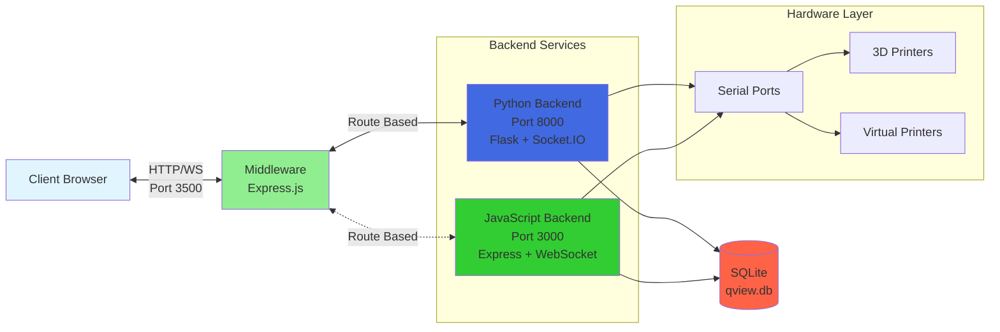
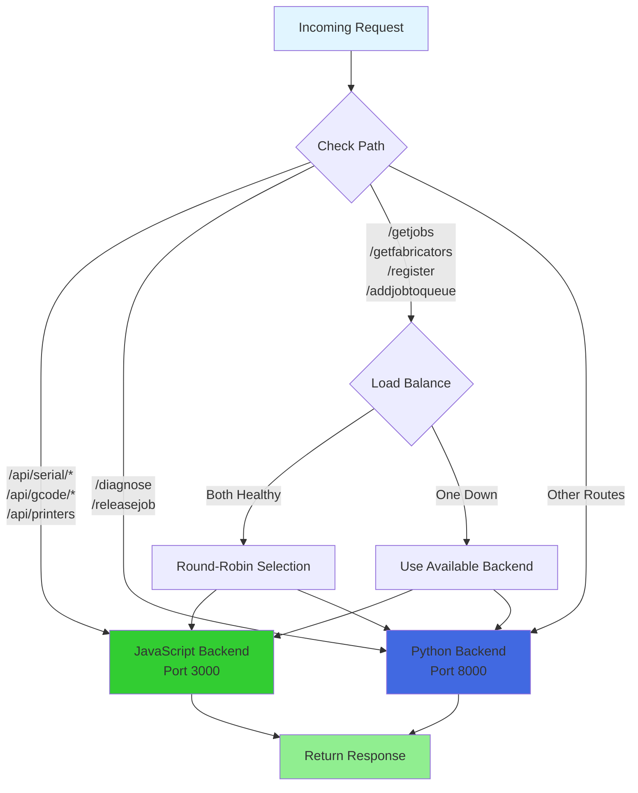

# QView3D Middleware

API gateway middleware for intelligent routing between Python and JavaScript backends.

## Overview

The middleware acts as a transparent proxy that routes requests to the appropriate backend based on the configured mode:

- **Python Mode**: All requests go to Python backend (default)
- **JavaScript Mode**: All requests go to JavaScript backend
- **Hybrid Mode**: Intelligent routing based on request path and backend capabilities

## Architecture

```
Client <-> Middleware (Port 3500) <-> Python Backend (Port 8000)
                                  <-> JavaScript Backend (Port 3000)
```

### Architecture Diagram



## Features

- Automatic backend health monitoring
- Intelligent request routing in hybrid mode
- Response normalization between backends
- WebSocket proxy support
- Automatic failover when backends are unavailable
- Request/response logging

## Configuration

Configuration is loaded from `server/config/config.json`:

```json
{
  "middleware": {
    "mode": "python",
    "port": 3500,
    "ws_port": 3501
  },
  "backends": {
    "python": {
      "url": "http://localhost:8000",
      "ws_port": 8001
    },
    "javascript": {
      "url": "http://localhost:3000",
      "ws_port": 3001
    }
  }
}
```

## Route Mapping (Hybrid Mode)

| Route Pattern | Backend | Notes |
|--------------|---------|-------|
| `/api/serial/*` | JavaScript | Serial port operations |
| `/api/gcode/*` | JavaScript | G-code parsing |
| `/api/printers` | JavaScript | Active printer status |
| `/getjobs` | Either | Load balanced - both backends support |
| `/getfabricators` | Either | Load balanced |
| `/register` | Either | Load balanced |
| `/addjobtoqueue` | Either | Load balanced |
| `/getissues` | Either | Load balanced |
| `/diagnose` | Python | Python-specific diagnostics |
| `/releasejob` | Python | Advanced job control |
| All others | Python | Default fallback |

**Note**: Routes marked "Either" use round-robin load balancing when both backends are healthy, with automatic failover if one becomes unavailable.

### Route Selection Flow



## Usage

### Starting the Middleware

The middleware is automatically started when you select backend mode via `run.py`:

```bash
python run.py
# Select [B] for Backend Selection
# Choose mode 3 for Hybrid Mode
```

### Manual Start

```bash
cd middleware
npm install
npm start
```

### Development Mode

```bash
npm run dev
```

## API Endpoints

### Health Check

```
GET /health
```

Returns middleware and backend status.

## Environment Variables

- `LOG_LEVEL`: Set logging level (ERROR, WARN, INFO, DEBUG)
- `NODE_ENV`: Set to 'production' to hide error details

## Backend Capabilities

### Python Backend
- Full database integration (SQLite)
- Complete job management system
- Fabricator registration and control
- Issue tracking
- Advanced diagnostics and repair tools
- Discord bot integration
- Emulator support

### JavaScript Backend
- SQLite database support
- Job management (create, queue, cancel, status)
- Fabricator registration and management
- Issue tracking
- Serial port communication
- WebSocket real-time updates
- Optimized for performance

## Backend Health Monitoring

The middleware performs health checks every 30 seconds on all configured backends:

- Marks backends as healthy/unhealthy
- Provides automatic failover in hybrid mode
- Exposes status via `/health` endpoint
- Load balances across healthy backends

## Response Normalization

The middleware normalizes responses between backends to ensure consistent API:

- Printer state mapping (numeric to string)
- Job data structure alignment
- Port list format standardization

## Error Handling

- Returns proper HTTP status codes
- Includes error details in development mode
- Logs all errors with context
- Attempts failover before returning 502 errors
