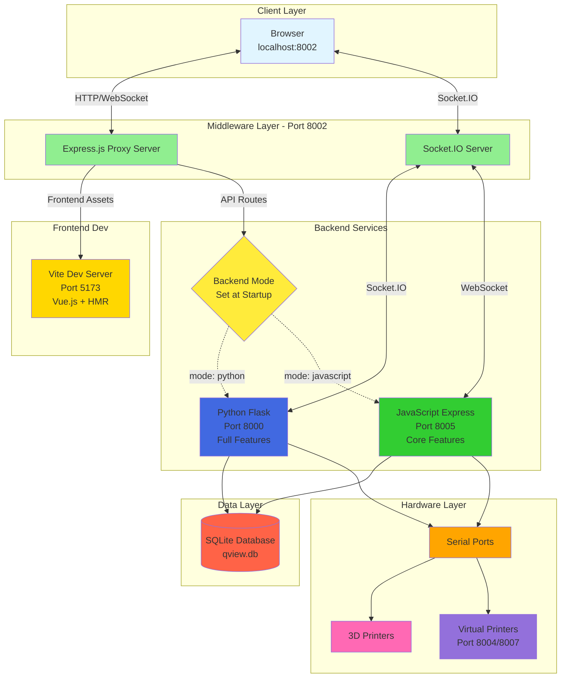
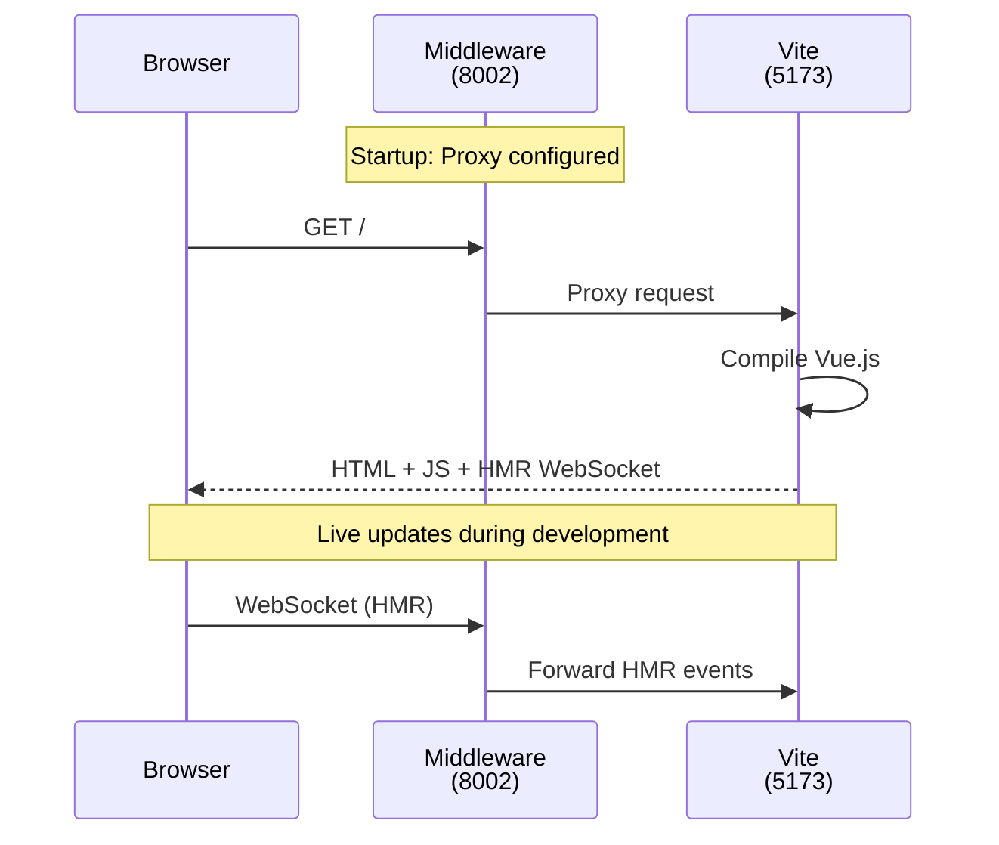
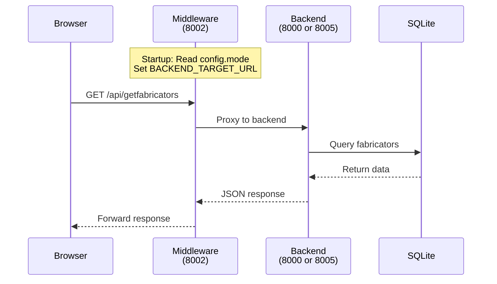
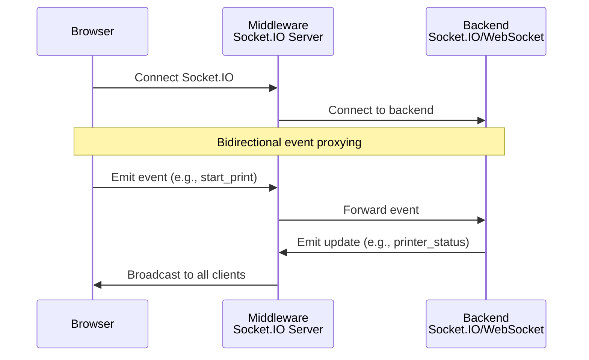

# QView3D Middleware

Static proxy server for QView3D 3D printer management system. Routes all frontend and API requests to a single backend configured at startup.

## System Architecture



## Request Flow

### Frontend Asset Loading


### API Request Flow


### Real-time Updates


## Configuration

**File:** `middleware/src/config/backends.js`

```javascript
export default {
  middleware: {
    mode: "python",  // "python" or "javascript"
    port: 8002       // Middleware port
  },
  backends: {
    python: {
      url: "http://localhost:8000"
    },
    javascript: {
      url: "http://localhost:8005"
    }
  }
};
```

## Port Configuration

| Service | Port | Protocol | Purpose |
|---------|------|----------|---------|
| **Middleware** | 8002 | HTTP/WS | Main entry point (access app here) |
| **Vite Dev** | 5173 | HTTP/WS | Frontend development with HMR |
| **Python Backend** | 8000 | HTTP/WS | Flask + PySerial + full features |
| **JavaScript Backend** | 8005 | HTTP/WS | Express + SerialPort + core features |
| **Emulator (Python)** | 8004 | HTTP | Virtual printer (Python) |
| **Emulator (JS)** | 8007 | HTTP | Virtual printer (JavaScript) |

## Technology Stack

### Middleware
- **Express.js 5.x** - Web server
- **http-proxy-middleware 3.x** - Proxy routing
- **Socket.IO 4.x** - Real-time bidirectional events
- **cors 2.x** - Cross-origin support

### Python Backend
- **Flask 3.x** - Web framework
- **Flask-SocketIO 5.x** - WebSocket support
- **SQLAlchemy 2.x** - Database ORM
- **PySerial 3.5+** - Serial communication
- **Eventlet 0.37+** - Async WSGI server

### JavaScript Backend
- **Express.js 5.x** - Web framework
- **sqlite3 5.x** - Database
- **@serialport/stream 13.x** - Serial communication
- **ws 8.x** - WebSocket

### Frontend
- **Vue.js 3** - UI framework
- **Vite 4.x** - Build tool with HMR
- **Bootstrap** - Styling

### Database
- **SQLite3** - Embedded database
- **Tables:** fabricators, jobs, queue, issues

## Running the Middleware

### Via run.py (Recommended)
```bash
python3 run.py
# Select 'D' for debug mode
# Middleware starts automatically
```

### Manually
```bash
cd middleware
npm install
npm start
```

### Debug Mode
```bash
DEBUG=true npm start
```
With `DEBUG=true`, middleware logs all proxied requests.

## API Routes Proxied

The middleware proxies these routes to the backend:

**Core API:**
- `/api/*` - All namespaced API endpoints

**Fabricator Management:**
- `/getfabricators`, `/registerfabricator`, `/deletefabricator`
- `/pauseprinter`, `/resumeprinter`, `/cancelprinter`
- `/getprinterinfo`, `/setstatus`

**Job Management:**
- `/getjobs`, `/addjob`, `/canceljob`, `/startprint`, `/releasejob`
- `/getjobhistory`, `/uploadfiles`, `/getfiles`, `/deletefile`

**Queue Management:**
- `/getqueue`, `/reorderqueue`, `/clearqueue`, `/autoqueue`
- `/addjobtoqueue`, `/cancelfromqueue`

**Emulator Management:**
- `/startemulator`, `/registeremulator`, `/disconnectemulator`
- `/getports`, `/register`

**Issue Tracking:**
- `/getissues`, `/createissue`, `/updateissue`, `/deleteissue`, `/resolveissue`

**System:**
- `/health`, `/serverVersion`
- `/socket.io` - WebSocket connection

**All other routes** → Proxied to Vite dev server (frontend assets)

## Health Check

```bash
curl http://localhost:8002/api/middleware/health
```

**Response:**
```json
{
  "status": "healthy",
  "backends": {
    "python": {
      "status": "healthy",
      "responseTime": 45
    },
    "javascript": {
      "status": "offline",
      "responseTime": null
    }
  }
}
```

**Debug mode:**
```bash
curl http://localhost:8002/api/middleware/health?debug=true
```

Returns full middleware config, uptime, and backend details.

## Key Features

### 1. Static Routing
- Backend selected ONCE at startup from config
- No per-request routing decisions
- Simple pass-through proxy for performance
- Restart required to change backend

### 2. Frontend Hot Module Replacement
- Vite WebSocket proxied automatically
- Instant updates (~200ms) during development
- No build step required

### 3. Socket.IO Bidirectional Proxying
- Middleware acts as Socket.IO server to clients
- Middleware acts as Socket.IO client to backend
- All events forwarded automatically
- Broadcasts to all connected clients

### 4. Health Monitoring
- Checks backend status every 10 seconds
- Warns if routing to unhealthy backend
- Exposes status via `/api/middleware/health`

### 5. Error Handling
- 500 for backend processing errors
- 502 for backend unavailable
- Detailed error messages in debug mode

## Development Notes

### Emulator Access
Virtual printers (emulators) route through middleware on port 8002, just like physical printers.

### Path Rewriting
API routes with `/api/` prefix are rewritten:
- Request: `GET /api/createissue`
- Proxied to: `GET /createissue` (prefix stripped)

Backend routes don't use `/api/` prefix internally.

### Backend Health Warnings
If backend is unhealthy, middleware logs warnings but still attempts to proxy:
```
[Proxy] WARNING: Routing to unhealthy backend (python): /getfabricators
```

### WebSocket Support
- Frontend HMR: Handled by Vite WebSocket
- Real-time updates: Handled by Socket.IO
- Both protocols proxied transparently

## Troubleshooting

**Middleware won't start:**
```bash
cd middleware
npm install
# Check if port 8002 is available
lsof -i :8002
```

**Vite connection failed:**
```bash
# Make sure Vite dev server is running
cd frontend
npm run dev
# Should start on port 5173
```

**Backend connection failed:**
```bash
# Check backend is running
python3 run.py  # Select 'D' for debug mode
# Python backend should start on port 8000
```

**Socket.IO not connecting:**
- Check browser console for connection errors
- Verify backend Socket.IO is running
- Check middleware logs for backend connection status

## Architecture Decisions

### Why Static Routing?
- **Simplicity:** No complex routing logic
- **Performance:** Direct proxy with no overhead
- **Reliability:** Fewer moving parts
- **Development:** Easy to reason about request flow

### Why Single Backend per Run?
- Backends are not interchangeable (Python has more features)
- No need for load balancing (single-user system)
- Simpler configuration and debugging
- Clear system state

### Why Middleware at All?
- **Single entry point:** Clients connect to one port
- **Development flexibility:** Frontend and backend developed independently
- **Frontend HMR:** Vite dev server proxied seamlessly
- **Backend abstraction:** Frontend doesn't need to know backend implementation

## File Structure

```
middleware/
├── src/
│   ├── config/
│   │   └── backends.js       # Backend configuration
│   ├── healthCheck.js         # Backend health monitoring
│   └── index.js               # Main middleware server
├── test/                      # Test files
├── package.json               # Dependencies
└── README.md                  # This file
```
