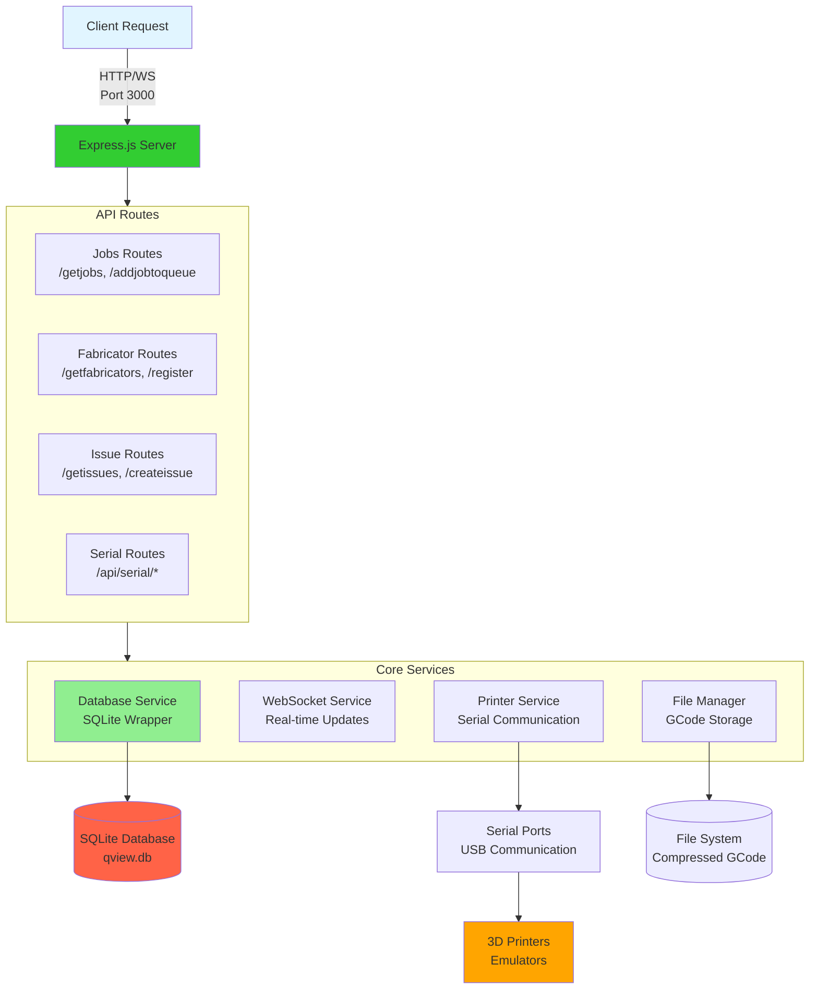
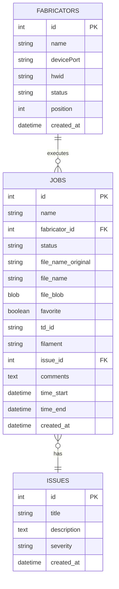

# QView3D JavaScript Backend

Node.js/Express backend implementation for QView3D with SQLite database support and serial communication capabilities.

## Features

- **Database Operations**: SQLite-based storage for jobs, fabricators, and issues
- **Job Management**: Complete job queue system with file upload support
- **Fabricator Control**: Printer registration, status management, and port detection
- **Issue Tracking**: Error logging and issue assignment to jobs
- **Serial Communication**: Direct serial port access for printer control
- **WebSocket Support**: Real-time bidirectional communication
- **REST API**: Full REST API matching Python backend endpoints

### Backend Architecture



## Installation

```bash
cd server-javascript
npm install
```

## Configuration

Copy `.env.example` to `.env` and configure:

```env
PORT=3000
DB_PATH=./data/qview.db
```

## Running

```bash
# Production mode
npm start

# Development mode with auto-reload
npm run dev
```

## API Endpoints

### Health Check
```
GET /health
```

### Job Management
- `GET /getjobs` - Get job history with filtering and pagination
- `POST /addjobtoqueue` - Add job to specific printer queue
- `POST /autoqueue` - Automatically assign job to least busy printer
- `POST /canceljob` - Cancel a specific job
- `POST /cancelfromqueue` - Cancel multiple jobs
- `POST /updatejobstatus` - Update job status
- `POST /deletejob` - Delete job from database
- `GET /getfile` - Retrieve job file content
- `POST /favoritejob` - Toggle job favorite status
- `GET /getfavoritejobs` - Get all favorite jobs
- `POST /assignissue` - Assign issue to job
- `POST /removeissue` - Remove issue from job
- `POST /savecomment` - Save comment to job
- `POST /startprint` - Start printing a job

### Fabricator/Printer Management
- `GET /getports` - List available serial ports
- `GET /getfabricators` - Get all registered fabricators
- `POST /register` - Register new fabricator
- `POST /deletefabricator` - Delete fabricator
- `POST /editname` - Update fabricator name
- `POST /setstatus` - Update fabricator status
- `POST /movefabricatorlist` - Reorder fabricators
- `POST /getfabricatorbyid` - Get specific fabricator

### Issue Tracking
- `GET /getissues` - List all issues
- `POST /createissue` - Create new issue
- `POST /updateissue` - Update existing issue
- `POST /deleteissue` - Delete issue
- `GET /getissue` - Get specific issue

### Serial Communication
- `GET /api/serial/ports` - List serial ports
- `POST /api/serial/connect` - Connect to printer
- `POST /api/serial/send` - Send G-code command
- `POST /api/serial/disconnect` - Disconnect from printer
- `GET /api/printers` - Get active printer connections

## Database Schema

### Fabricators Table
- `id` - Primary key
- `name` - Fabricator name
- `devicePort` - Serial port path
- `hwid` - Hardware ID
- `status` - Current status (offline, ready, printing, etc.)
- `position` - Display order
- `created_at` - Creation timestamp

### Jobs Table
- `id` - Primary key
- `name` - Job name
- `fabricator_id` - Foreign key to fabricators
- `status` - Job status (inqueue, printing, completed, etc.)
- `file_name_original` - Original filename
- `file_name` - Unique filename with ID
- `file_blob` - Compressed G-code file
- `favorite` - Favorite flag
- `td_id` - External tracking ID
- `filament` - Filament type
- `issue_id` - Foreign key to issues
- `comments` - User comments
- `time_start` - Print start time
- `time_end` - Print end time
- `created_at` - Creation timestamp

### Issues Table
- `id` - Primary key
- `title` - Issue title
- `description` - Detailed description
- `severity` - Severity level
- `created_at` - Creation timestamp

### Database Entity Relationships



## File Upload

Jobs accept G-code files which are:
1. Compressed using gzip
2. Stored in database as BLOB
3. Named with unique ID: `filename_123.gcode`
4. Decompressed on retrieval

## WebSocket

WebSocket server runs on the same port as HTTP server. Supports:
- Real-time printer status updates
- Job progress notifications
- Bidirectional messaging

Connect to: `ws://localhost:3000`

## Development

### Project Structure
```
server-javascript/
├── src/
│   ├── index.js          # Main server entry point
│   ├── database.js       # Database wrapper
│   ├── websocket.js      # WebSocket manager
│   ├── printer.js        # Printer control class
│   ├── serialport.js     # Serial port wrapper
│   ├── routes/
│   │   ├── jobs.js       # Job endpoints
│   │   ├── fabricators.js # Fabricator endpoints
│   │   └── issues.js     # Issue endpoints
│   └── util/
│       └── log.js        # Logging utilities
└── data/                 # SQLite database location
```

### Adding New Endpoints

1. Create route in `src/routes/`:
```javascript
router.post('/newroute', async (req, res) => {
  try {
    // Implementation
    res.json({ success: true });
  } catch (error) {
    res.status(500).json({ error: error.message });
  }
});
```

2. Register in `src/index.js`:
```javascript
import newRouter from './routes/new.js';
app.use('/', newRouter);
```

## Error Handling

All endpoints include try-catch blocks with:
- Appropriate HTTP status codes
- Error messages in JSON format
- Detailed error logging to console

## Integration

Works standalone or with middleware for hybrid mode:
- Standalone: Client connects directly to port 3000
- Hybrid: Middleware routes requests based on capabilities
- Load balanced: Shares load with Python backend

## Testing

Run the health endpoint to verify:
```bash
curl http://localhost:3000/health
```

Expected response:
```json
{
  "status": "healthy",
  "service": "qview3d-javascript-backend",
  "uptime": 123.45
}
```
